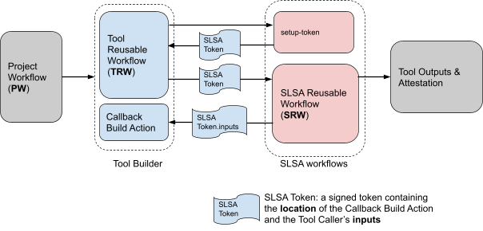

# Build Your Own Builder (BYOB) Framework

<!-- toc -->

- [Design Overview](#design-overview)
  - [Project Workflow (PW)](#project-workflow-pw)
  - [Tool Repository](#tool-repository)
    - [Tool Reusable Workflow (TRW)](#tool-reusable-workflow-trw)
    - [Tool Callback Action (TCA)](#tool-callback-action-tca)
  - [SLSA GitHub Repository](#slsa-github-repository)
    - [SLSA Setup Action (SSA)](#slsa-setup-action-ssa)
    - [SLSA Reusable Workflow (SRW)](#slsa-reusable-workflow-srw)
- [Example: Convert a GitHub Action to be SLSA3 Compliant](#example-convert-a-github-action-to-be-slsa3-compliant)
  - [Before you begin: understand supported triggers](#before-you-begin-understand-supported-triggers)
  - [Step 1: TRW inputs](#step-1-trw-inputs)
    - [Inputs](#inputs)
    - [Secrets](#secrets)
    - [Outputs](#outputs)
    - [Important Notes](#important-notes)
  - [Step 2: SRW Setup](#step-2-srw-setup)
  - [Step 3: SRW Invocation](#step-3-srw-invocation)
  - [Step 4: Creating a TCA](#step-4-creating-a-tca)
    - [Inputs](#inputs-1)
    - [Outputs](#outputs-1)
    - [Invocation of Existing Action](#invocation-of-existing-action)
    - [Generation of Metadata Layout File](#generation-of-metadata-layout-file)
  - [Step 5: Upload Attestations](#step-5-upload-attestations)
- [PW Integration](#pw-integration)
  - [PW Call](#pw-call)
  - [Provenance Example](#provenance-example)
- [Hardening](#hardening)
  - [Least Privileged TCA](#least-privileged-tca)
    - [Low-Permission SRW](#low-permission-srw)
    - [Update TCA](#update-tca)
    - [Update TRW](#update-trw)
  - [Best SDLC Practices](#best-sdlc-practices)

<!-- tocstop -->

## Design Overview

The Build Your Own Builder (BYOB) framework makes it simple to make an existing GitHub Action SLSA3 compliant. Instead of handling the complexity around reuseable workflows, signing, intoto, Sigstore, etc, you can simply delegate orchestration and provenance generation to the BYOB framework.

The diagram below depicts the different components of the BYOB framework. We'll cover the different portions in our overview.



### Project Workflow (PW)

The Project Workflow (PW) is hosted in the repository that wants to build an artifact. As part of a build, the PW invokes the SLSA compliant builder defined by the Tool Reuseable Workflow (TRW):

```yaml
- uses: npm/builder/.github/workflows/slsa.3.yml@vx.y.z
```

The example snippet shows the invocation of a builder with path `.github/workflows/slsa.3.yml` from the GitHub's `npm/builder` repository.

### Tool Repository

The tool repository hosts the builder invoked by PWs. The tool repository MUST be public. The repository contains two components, the Tool Reuseable Workflow and the Tool Callback Action.

#### Tool Reusable Workflow (TRW)

The "Tool Reusable Workflow" (TRW) is the SLSA compliant builder that will "wrap" an existing GitHub Action. End users' PWs invoke the TRW to build their artifacts. The TRW workflow file must be created as part of the integration.

#### Tool Callback Action (TCA)

The "Tool Callback Action" (TCA) is the GitHub Action that is invoked by the BYOB framework in an isolated GitHub job. The TCA does the following:

- Sets the environment. For example, if the builder wants to build Go projects, the TCA would install the Go compiler.
- Calls your existing GitHub Action. For example, if the builder wants to make the GoReleaser Action SLSA compliant, the TCA would call the existing `goreleaser/goreleaser-action` after it has set up the environment.
- Outputs attestation metadata (name, binaries and hashes) that are used by the framework to generate SLSA provenance.

### SLSA GitHub Repository

The [slsa-github-generator](https://github.com/slsa-framework/slsa-github-generator) repository hosts the code for the BYOB framework maintained by the OpenSSF SLSA tooling team. There are two main components you will use for your integration, the SLSA Setup Action and the SLSA Reuseable Workflow.

#### SLSA Setup Action (SSA)

The [setup-generic](https://github.com/slsa-framework/slsa-github-generator/blob/main/actions/delegator/setup-generic) Action is used to initialize the BYOB framework. It returns a so-called "SLSA token" which is used in later steps:

```yaml
- uses: slsa-framework/slsa-github-generator/actions/delegator/setup-generic@v2.0.0
```

#### SLSA Reusable Workflow (SRW)

The SLSA Reuseable Workflow (SRW) acts as the build's orchestrator. It calls the TCA, generates provenance, and returns the provenance to its TRW caller. A TRW would typically call the SRW as follows:

```yaml
- uses: slsa-framework/slsa-github-generator/.github/workflow/delegator_generic_slsa3.yml@v2.0.0
  with:
    slsa-token: ${{ needs.slsa-setup.outputs.slsa-token }}
```

## Example: Convert a GitHub Action to be SLSA3 Compliant

In this example, we will assume there is an existing [GitHub Action](https://github.com/laurentsimon/byob-doc/tree/v0.0.1/action.yml) which builds an artifact.
The Action does the following:

- [Echos the parameters into the artifact](https://github.com/laurentsimon/byob-doc/tree/v0.0.1/action.yml#L58).
- Takes a [username, password and token](https://github.com/laurentsimon/byob-doc/tree/v0.0.1/action.yml#L31-L34) to retrieve / push information from a remote registry.
- [Releases the built artifact to GitHub releases](https://github.com/laurentsimon/byob-doc/tree/v0.0.1/action.yml#L67-L78) (similarly to popular release Actions).
- Outputs the [name of the built artifact and the status of the build](https://github.com/laurentsimon/byob-doc/tree/v0.0.1/action.yml#L35-L41).

See the full [action.yml](https://github.com/laurentsimon/byob-doc/tree/v0.0.1/action.yml).

Some more advanced topics are ommitted for clarity, but can be found in the [Section: Hardening](#hardening). Once you have completed this example and the [provenance example](#provenance-example), we recommend following the steps in [Section: Hardening](#hardening), as it represents best security practice.

### Before you begin: understand supported triggers

Only the following [event types] are supported as recommended by the [SLSA specifications](https://github.com/slsa-framework/github-actions-buildtypes/tree/main/workflow/v1#description):

| Supported event type  | Event description                          |
| --------------------- | ------------------------------------------ |
| [`create`]            | Creation of a git tag or branch.           |
| [`release`]           | Creation or update of a GitHub release.    |
| [`push`]              | Creation or update of a git tag or branch. |
| [`workflow_dispatch`] | Manual trigger of a workflow.              |

`pull_request` events are currently not supported. If you would like support for
`pull_request`, please tell us about your use case on
[issue #358](https://github.com/slsa-framework/slsa-github-generator/issues/358). If
you have an issue related to any other triggers please submit a
[new issue](https://github.com/slsa-framework/slsa-github-generator/issues/new/choose).

[event types]: https://docs.github.com/en/actions/using-workflows/events-that-trigger-workflows
[`create`]: https://docs.github.com/en/actions/using-workflows/events-that-trigger-workflows#create
[`release`]: https://docs.github.com/en/actions/using-workflows/events-that-trigger-workflows#release
[`push`]: https://docs.github.com/en/actions/using-workflows/events-that-trigger-workflows#push
[`workflow_dispatch`]: https://docs.github.com/en/actions/using-workflows/events-that-trigger-workflows#workflow_dispatch

### Step 1: TRW inputs

The first step for our integration is to create our TRW file and define its inputs. The inputs should mirror those of the existing Action above that we want to make SLSA compliant.

#### Inputs

Inputs that have low entropy are defined under the [inputs section](https://github.com/laurentsimon/byob-doc/tree/v0.0.1/.github/workflows/builder_example_slsa3.yml#L25-L39). Unlike Action inputs, you may define the type ([boolean, number, or string](https://docs.github.com/en/actions/using-workflows/reusing-workflows)) of each input. You may also provide a default value. The inputs will be attested to in the generated provenance. We will discuss in [Section: SRW Setup](#srw-setup) how to redact certain inputs that might be sensitive, such as username, from the provenance.

We also declare an additional [rekor-log-public](https://github.com/laurentsimon/byob-doc/tree/v0.0.1/.github/workflows/builder_example_slsa3.yml#L43-L47) boolean input. Given that the name of the repository will be available in the provenance and will be uploaded to the public transparency log, we need users to acknowledge that they are aware that private repository names will be made public. We encourage all TRWs to define this option. For public repositories, the value of the input is set to true by default by the SRW. For private repositories, users should set if to true when calling the TRW.

#### Secrets

Unlike Actions, secrets are defined under a separate [secrets section](https://github.com/laurentsimon/byob-doc/tree/v0.0.1/.github/workflows/builder_example_slsa3.yml#L49-L57).

Secrets should only be high-entropy values. Do not set username or other low-entropy PII as secrets, as it may intermittently fail due to this [unresolved GitHub issue](https://github.com/orgs/community/discussions/37942). Secrets may be marked as optional. Unlike for Actions, secrets cannot have default values. In our example, the [token](https://github.com/laurentsimon/byob-doc/tree/v0.0.1/.github/workflows/builder_example_slsa3.yml#L55-L57) secret has no default value, whereas the original Action [had one](https://github.com/laurentsimon/byob-doc/tree/v0.0.1/action.yml#L33). We will see in [Section: Invocation of Existing Action](#invocation-of-existing-action) how to set default values in the TCA.

#### Outputs

The outputs from the TCA may be returned to the PW as well. To do this, use the [outputs section](https://github.com/laurentsimon/byob-doc/tree/v0.0.1/.github/workflows/builder_example_slsa3.yml#L61-L67) to define the artifact and the status. Our example uses [additional outputs](https://github.com/laurentsimon/byob-doc/tree/v0.0.1/.github/workflows/builder_example_slsa3.yml#L69-L75) to  provide metadata about the built artifacts and their provenance. We will discuss them in [Section: Upload Attestations](#upload-attestations).

#### Important Notes

One key difference between the Action and reusable workflow is isolation. The SRW runs on a different VM than the TRW; and the TRW runs on a different VM from the PW. This means that the artifact built by the TCA (which is managed by the SRW) is not accessible directly by the TRW. The SRW needs to share these files with the TRW; which may also share them with the PW. How to handle this isolation is discussed in [Section: SRW Setup](#srw-setup). The [TRW outputs](https://github.com/laurentsimon/byob-doc/tree/v0.0.1/.github/workflows/builder_example_slsa3.yml#L69-L88) provides the metadata necessary to download these files, and we will discuss them in [Section: Upload Attestations](#upload-attestations).

### Step 2: SRW Setup

Our next step is to initialize the SRW framework. To do this, the TRW must invoke the [setup-generic Action](https://github.com/slsa-framework/slsa-github-generator/blob/main/actions/delegator/setup-generic/action.yml). The [relevant code](https://github.com/laurentsimon/byob-doc/blob/v0.0.1/.github/workflows/builder_example_slsa3.yml#L85-L94) calls the SSA as follows:

```yaml
uses: slsa-framework/slsa-github-generator/actions/delegator/setup-generic@v2.0.0
  with:
    slsa-workflow-recipient: "delegator_generic_slsa3.yml"
    slsa-rekor-log-public: ${{ inputs.rekor-log-public }}
    slsa-runner-label: "ubuntu-latest"
    slsa-build-action-path: "./internal/callback_action"
    slsa-workflow-inputs: ${{ toJson(inputs) }}
    slsa-workflow-masked-inputs: username
```

Let's go through the parameters:

- `slsa-workflow-recipient` is the name of the SRW we are initializing. This is the workflow that we will call to run the build in our example.
- `slsa-rekor-log-public` is simply the same as the TRW's `slsa-rekor-log-public` input, so we just set the value with the TRW's value.
- `slsa-runner-label` is the runner label to run the build on. We currently only support ubuntu runners, but we will add support for other runners in the future.
- `slsa-build-action-path` is the path to our TCA, relative to the root of the repository.
- `slsa-workflow-inputs` are the inputs to the TRW, which the provenance will attest to. These inputs are also provided to the TCA by the BYOB framework.
- `slsa-workflow-masked-inputs` is a list of comma separated field names that are redacted from the generated SLSA provenance. In this example, we're telling the TRW that the username input should be redacted. Any TRW `secrets` are separate from `inputs` and thus are automatically excluded from the provenance.

### Step 3: SRW Invocation

Once we have initialized the SRW, we [call the SRW](https://github.com/laurentsimon/byob-doc/blob/v0.0.1/.github/workflows/builder_example_slsa3.yml#L96-L108):

```yaml
slsa-run:
  needs: [slsa-setup]
  permissions:
    id-token: write # For signing.
    contents: write # For asset uploads.
    packages: write # For package uploads.
    actions: read # For the entrypoint.
  uses: slsa-framework/slsa-github-generator/.github/workflows/delegator_generic_slsa3.yml@v2.0.0
  with:
    slsa-token: ${{ needs.slsa-setup.outputs.slsa-token }}
  secrets:
    secret1: ${{ inputs.password }}
    secret2: ${{ inputs.token }}
```

In addition to the token, we also [provide the secrets](https://github.com/laurentsimon/byob-doc/blob/v0.0.1/.github/workflows/builder_example_slsa3.yml#L107-L108). Up to 15 secrets are supported. Secrets are simply passed to the TCA. They are not included in provenance.

### Step 4: Creating a TCA

The call that we constructed in [Step 3](#step-3-srw-invocation) will run the SRW and invoke the callback Action, which we will define in this step. The Action code is available under [internal/callback_action](https://github.com/laurentsimon/byob-doc/tree/v0.0.1/internal/callback_action/).

#### Inputs

The inputs to the TCA are [pre-defined](https://github.com/laurentsimon/byob-doc/tree/v0.0.1/internal/callback_action/action.yml#L6-L14), so you just have to follow their definition:

- `slsa-workflow-inputs` contains a JSON object with a list of key-value pairs for the inputs provided by the [TRW to the SSA during initialization](https://github.com/laurentsimon/byob-doc/blob/v0.0.1/.github/workflows/builder_example_slsa3.yml#L93).
- `slsa-layout-file` is a path to a file where we will write a layout for generating the attestation.
- `slsa-workflow-secretX`, where X is the number '1' to '15'. These contain the secrets that the TRW [provides to the SRW during invocation](https://github.com/laurentsimon/byob-doc/blob/v0.0.1/.github/workflows/builder_example_slsa3.yml#L106-L108). Unused secrets [should be clearly marked as unused](https://github.com/laurentsimon/byob-doc/tree/v0.0.1/internal/callback_action/action.yml#L26-L39).

#### Outputs

We [declare the same outputs](https://github.com/laurentsimon/byob-doc/tree/v0.0.1/internal/callback_action/action.yml#L41-L47) as the existing Actions. These outputs are made available to the TRW by the BYOB framework. They [may be returned by the TRW to the PW](https://github.com/laurentsimon/byob-doc/tree/v0.0.1/.github/workflows/builder_example_slsa3.yml#L61-L67).

#### Invocation of Existing Action

We [invoke the existing Action](https://github.com/laurentsimon/byob-doc/tree/v0.0.1/internal/callback_action/action.yml#L57-L65) by its path and pass it the inputs by extracting them from the `slsa-workflow-inputs` argument:

```yaml
uses: ./../__TOOL_CHECKOUT_DIR__
id: build
  with:
    artifact: ${{ fromJson(inputs.slsa-workflow-inputs).artifact }}
    content: ${{ fromJson(inputs.slsa-workflow-inputs).content }}
    username: ${{ fromJson(inputs.slsa-workflow-inputs).username }}
    password: ${{ inputs.slsa-workflow-secret1 }}
    token: ${{ inputs.slsa-workflow-secret2 || github.token }}
```

Note that the `./../__TOOL_CHECKOUT_DIR__` is the path where the TRW repository is checked out by the BYOB framework, so it's accessible locally. You can then call your existing action at the path `./../__TOOL_CHECKOUT_DIR__/path/to/action` where `/path/to/action` is the path to your action's `action.yml` relative to the repository root. In the above example, we are assuming our `action.yml` is defined in the repository root.
Notice how we populate the token field: If the user has not passed a value to `inputs.slsa-workflow-secret2`, we default to using the GitHub token `github.token`.

#### Generation of Metadata Layout File

The last thing to do in the TCA is to [generate the metadata layout file](https://github.com/laurentsimon/byob-doc/tree/v0.0.1/internal/callback_action/action.yml#L67-L73) to indicate to the BYOB platform which files to attest to, and which attestations to generate. You can ask the platform to generate several attestations, each attestating to one or more artifacts. The snippet below indicates a single attestation attesting to a single built artifact `my-artifact`. When the BYOB framework generates the attestation, it will add the `.build.slsa` extension to it.

```json
{
  "version": 1,
  "attestations": [
    {
      "name": "my-artifact",
      "subjects": [
        {
          "name": "my-artifact",
          "digest": {
            "sha256": "c71d239df91726fc519c6eb72d318ec65820627232b2f796219e87dcf35d0ab4"
          }
        }
      ]
    }
  ]
}
```

### Step 5: Upload Attestations

In a final ["publish" job](https://github.com/laurentsimon/byob-doc/tree/v0.0.1/.github/workflows/builder_example_slsa3.yml#L110-L141) of the TRW, we [download the attestations](https://github.com/laurentsimon/byob-doc/tree/v0.0.1/.github/workflows/builder_example_slsa3.yml#L117C19-L121) and do whatever we'd like with them. In our example, we [simply print the filename](https://github.com/laurentsimon/byob-doc/tree/v0.0.1/.github/workflows/builder_example_slsa3.yml#L123-L141). You may instead upload them to a GitHub release, a registry, etc.

You may want to [return the attestation to the PW](https://github.com/laurentsimon/byob-doc/tree/v0.0.1/.github/workflows/builder_example_slsa3.yml#L69-L75) in case end-users want to publish the artifacts and attestations themselves. If you do so, we encourage you to create a [secure-download-attestation](https://github.com/laurentsimon/byob-doc/tree/v0.0.1/download/attestation/action.yml) Action for your users under a download folder in your repository. This will improve user experience as they won't have to be aware of the SLSA repository and its framework.

## PW Integration

<!-- TODO(#2405): Provide a little context about what you mean by "PW integration" -->

### PW Call

The PW workflow will call your builder as follows:

```yaml
jobs:
  build:
    permissions:
      id-token: write # For signing
      contents: read # For asset release.
      actions: read # For getting workflow run info.
    uses: laurentsimon/byob-doc/.github/workflows/builder_example_slsa3.yml@v0.0.1
    with:
      artifact: my-artifact
      content: "hello world"
    secrets:
      password: ${{ secrets.PASSWORD }}
```

### Provenance Example

TODO

## Hardening

If you've made it thus far, congratulations! You have built a SLSA3 compliant builder. In this section, we provide additional guidance and tips to harden your implementation.

### Least Privileged TCA

In the example of [Section: Integration Steps](#integration-steps), we assumed that the existing Action released assets on GitHub. This is a common feature across build / release Actions. Depending on the use case, this requires the Action to have access to:

- `contents: write`: token permissions: to upload GitHub assets to GitHub releases. This also grants the Action the ability to push code to the PW repository.
- `packages: write`: to upload a package on GitHub registry.
- `secrets`: used to log into a registry to publish a package

Building an artifact or a package includes downloading dependencies. Every once in a while, dependencies built into a final package may turn out to be malicious. In these rare cases, the PW maintainers and its downstream users will start an incidence response to determine what systems may have been compromised by a rogue dependency. In certain ecosystems like npm or python, dependencies _may_ run arbitrary code as part of the build process, which means they have access to sensitive passwords and the permissions granted to the TCA. To reduce the consequences of a rogue dependency, we recommend following the principle of least privilege, and only give the minimal permissions to the TCA. Let's see how to update our initial integration to do that.

#### Low-Permission SRW

The first thing to do is to use a "low permission SRW". The SRW we used in our original integration is [delegator_generic_slsa3.yml](https://github.com/slsa-framework/slsa-github-generator/blob/main/.github/workflows/delegator_generic_slsa3.yml), which calls the TCA with the [permissions for pushing release assets and publishing packages](https://github.com/slsa-framework/slsa-github-generator/blob/01daa2e7c2c1c28d3bfbc3882102aed5da60121f/.github/workflows/delegator_generic_slsa3.yml#L137-L140). In order to reduce the number of permissions the TCA is called with, we recommend you use [delegator_lowperms-generic_slsa3.yml](https://github.com/slsa-framework/slsa-github-generator/blob/main/.github/workflows/delegator_lowperms-generic_slsa3.yml) instead. This workflow does _not_ give the TCA the dangerous permissions above, and [only gives it `contents: read`](https://github.com/slsa-framework/slsa-github-generator/blob/01daa2e7c2c1c28d3bfbc3882102aed5da60121f/.github/workflows/delegator_lowperms-generic_slsa3.yml#L142-L143) for repository read access. To update your integration:

- Update the [`slsa-workflow-receipient` argument to the SSA](https://github.com/laurentsimon/byob-doc/tree/v0.0.2/.github/workflows/builder_example_slsa3.yml#L89) to `delegator_lowperms-generic_slsa3.yml`.
- Update your SRW call to use [delegator_lowperms-generic_slsa3.yml](https://github.com/laurentsimon/byob-doc/tree/v0.0.2/.github/workflows/builder_example_slsa3.yml#L102).
- Update the [permissions you pass to the SRW](https://github.com/laurentsimon/byob-doc/tree/v0.0.2/.github/workflows/builder_example_slsa3.yml#L99-L101), by removing `packages: write` and updating the contents permission to `contents: read`.

#### Update TCA

The next thing to do is to [_not_ upload the asset to the GitHub release](https://github.com/laurentsimon/byob-doc/blob/v0.0.1/action.yml#L67-L78) within the existing Action and update the TCA to securely share the built artifacts with the TRW. (The TRW will later be updated to publish the artifacts). To update the TCA:

- [Generate a random value](https://github.com/laurentsimon/byob-doc/tree/v0.0.2/internal/callback_action/action.yml#L81-L86) to uniquely name your artifact. This is necessary to avoid name collisions if multiple builders run concurrently. This could be concurrent runs of your builder, or someone else's builder.
- [Create a folder with all the generated artifacts](https://github.com/laurentsimon/byob-doc/tree/v0.0.2/internal/callback_action/action.yml#L88-L98). In our case, we build a single artifact.
- [Securely share the built artifacts with the TRW](https://github.com/laurentsimon/byob-doc/tree/v0.0.2/internal/callback_action/action.yml#L100-L106). For this you need to use the [secure-upload-folder Action](https://github.com/slsa-framework/slsa-github-generator/tree/main/actions/delegator/secure-upload-folder). This Action uploads the entire folder and returns the sha256 digest as its output, which we will use during download. It's important to note that the "artifact name" refers to the unique name given to the object shared with the TRW, and can be different from the artifact filename our TCA built.
- [Add outputs to return the name and digest of the uploaded artifact](https://github.com/laurentsimon/byob-doc/tree/v0.0.2/internal/callback_action/action.yml#L48-L53).

#### Update TRW

Now we need to download the artifact and publish it from the TRW. To do that, follow these steps:

- [Download the artifacts](https://github.com/laurentsimon/byob-doc/tree/v0.0.2/.github/workflows/builder_example_slsa3.yml#L142-L149) uploaded by the TCA.
- [Publish the artifacts](https://github.com/laurentsimon/byob-doc/tree/v0.0.2/.github/workflows/builder_example_slsa3.yml#L151-L168).

### Best SDLC Practices

It is important you follow best development practices for your code, including your TRW, TCA and existing Action. In particular:

- Harden your CI, e.g., set your [top-level workflow permissions](https://docs.github.com/en/actions/using-jobs/assigning-permissions-to-jobs#example-assigning-permissions-to-github_token) to `read-only`.
- Pin your depenencies by hash except the [delegator workflow](https://github.com/slsa-framework/slsa-github-generator/tree/main#referencing-slsa-builders-and-generators), to avoid dependency confusion attacks and speed up incidence response.
- If you download binaries, verify their SLSA provenance before running them. Use the [`installer`](https://github.com/slsa-framework/slsa-verifier/tree/main/actions/installer) action to install and use `slsa-verifier`.
- Install or use a tool like [OSSF Scorecard](https://github.com/ossf/scorecard) to verify you're comprehensively looking at your SDLC.
