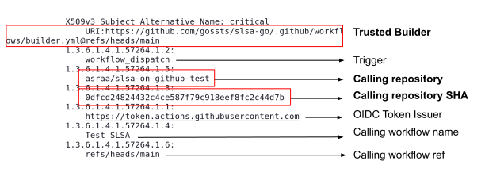

# Technical Design

---

<!-- markdown-toc --bullets="-" -i SPECIFICATIONS.md -->

<!-- toc -->

- [Problem statement](#problem-statement)
- [Threat model](#threat-model)
- [Trusted builder and provenance generator](#trusted-builder-and-provenance-generator)
  - [Interference between jobs](#interference-between-jobs)
- [Workflow identity using OIDC and keyless signing](#workflow-identity-using-oidc-and-keyless-signing)
  - [Example workflow for Go](#example-workflow-for-go)
  - [Provenance Verification](#provenance-verification)
  - [Detailed Steps](#detailed-steps)
  - [Verification Latency](#verification-latency)
- [Threats covered](#threats-covered)
- [SLSA4 requirements](#slsa4-requirements)
  - [Build-level provenance](#build-level-provenance)
  - [Source-level provenance](#source-level-provenance)

<!-- tocstop -->

---

## Problem statement

There are a large number of projects that are "GitHub native", in the sense they are developed, reviewed and released entirely on GitHub. Developers of such projects may release binaries or publish packages on registries (e.g., npm, Python). Those users do not want to pay for external cloud services to build/package their software, and want to keep using the tooling they are accustomed to on GitHub.

On GitHub, actions such as [go-releaser](https://github.com/goreleaser/goreleaser-action), [docker-releaser](http://github.com/docker/build-push-action), [pypi-publish](http://github.com/pypa/gh-action-pypi-publish) are a standard way used to release artifacts for go, docker and Python packages respectively (other package managers have similar actions).

In this proposal, we propose a flow to achieve non-forgeable (build and source) [provenance](https://slsa.dev/provenance/v0.2) using GitHub's standard workflows with a trusted action:

- The process is compatible with existing release processes, and we provide a layer to build provenance using actions. In the future the provenance generation can be incorporated into the standard actions that developers already use; or they could switch to using our action instead.
- The code in this repository demonstrates that provenance generation is achievable using existing tooling provided by the open-source community, and provide a prototype implementation for the Go ecosystem that includes a guaranteed isolated and ephemeral build.

An additional constraint we impose is that users should not need to manage cryptographic keys because they are hard to discover, keep safe, revoke and manage. In GitHub workflows, this is particularly important because [encrypted secrets](https://docs.github.com/en/actions/security-guides/encrypted-secrets) are accessible to all repo maintainers with push access, regardless of the branch protection settings.

The scope of the current design is limited to generating build provenance that satisfies SLSA 3 requirements. Extending to SLSA 4 would require a similar design to generate non-forgeable attestations on source repository settings (e.g. code review), hermeticity, and reproducibility. The latter two build requirements may be ecosystem dependent, but if the ecosystem tooling supports it, then attestations on these can be generated with this design. Source level settings could use Scorecards, Allstar, or other similar tools.

## Threat model

Non-forgeable provenance requires trust in the builder, the provenance generator (reusable workflow), the provenance verifier, and the platform they run on (GitHub): those are part of the TCB.

| Component                                                           | Requires trust for                                                                                                                                                                                                                                        |
| ------------------------------------------------------------------- | --------------------------------------------------------------------------------------------------------------------------------------------------------------------------------------------------------------------------------------------------------- |
| **GitHub**                                                          | - Executing expected code in workflows<br>- Integrity of data passed between job VMs<br>- Isolation of defaults, environment variables between caller workflows and reusable workflows<br>- Isolation between jobs of a workflow<br>- OIDC token issuance |
| **SigStore**                                                        | - Ephemerality of signing key<br>- Fulcio authentication for signing certificate                                                                                                                                                                          |
| **Generator workflow/Verifiers**<br>(the trusted reusable workflow) | - Generating correct contents of the provenance<br>- Build process isolation<br>- Correct verification of the signatures and provenance                                                                                                                   |

We do not trust the users (project maintainers) of the builders. Even if they are malicious, they cannot tamper with the provenance. The content of the source code is out of scope: users may manipulate the repository’s code, including the environment variables declared in the build configuration files in the source, but they cannot produce incorrect provenance. The provenance will still be valid and non-forgeable; it also contains the source repository reference where that code is defined.

## Trusted builder and provenance generator

Non-forgeable provenance requires a trusted builder and a trusted provenance generator that are isolated from one another and from maintainer's interference. These are often referred to as "trusted builders" in the SLSA nomenclature. There is a direct mapping between the expected isolation we need and GitHub runners.

According to [GitHub's official documentation](https://docs.github.com/en/actions/using-github-hosted-runners/about-github-hosted-runners), "each job in a workflow executes in a fresh instance of the virtual machine." Data can be [passed](https://docs.github.com/en/actions/using-workflows/storing-workflow-data-as-artifacts#passing-data-between-jobs-in-a-workflow) between jobs using [GitHub's artifact registry within the workflow](https://github.com/actions/upload-artifact). In other words, the workflow is like the orchestrator that "glues" jobs together. We propose using a job as the isolation mechanism for our trusted builder and our trusted provenance generator.

A GitHub workflow may be run either on [GitHub-hosted runners](https://docs.github.com/en/actions/using-github-hosted-runners/about-github-hosted-runners) or on [self-hosted runners](https://docs.github.com/en/actions/hosting-your-own-runners/about-self-hosted-runners). In the case of a self-hosted runner, a verifier has no guarantee that the code run is in fact the intended workflow unless they also trust the self-hosted runner. GitHub-hosted runners give us this guarantee, so long as we trust GitHub. In this document, we make the assumption that we trust GitHub to run the exact code defined in the workflow.

Below is an example workflow depicting job definitions:

```yaml
name: A workflow
on:
  workflow_dispatch:

jobs:
  vm1: // Isolated job called "vm1"
    runs-on: ubuntu-latest
    run: "echo hello world"
    ...
  vm2: // Isolated job called "vm2"
    uses: some/action
  vm3: // Isolated job called "vm3"
    uses: another/action
```

An example of the output provenance can be found the [README.md#example-provenance](README.md#example-provenance).

### Interference between jobs

Project maintainers are in charge of defining the workflows that release the build, so they could, in principle, try to define the workflow in a way that interferes with the builder. This would allow them to alter the provenance information. For example, [environment variables](https://docs.github.com/en/actions/using-workflows/workflow-syntax-for-github-actions#env), [steps](https://docs.github.com/en/actions/using-workflows/workflow-syntax-for-github-actions#jobsjob_idsteps), [services](https://docs.github.com/en/actions/using-workflows/workflow-syntax-for-github-actions#jobsjob_idservices) and [defaults](https://docs.github.com/en/actions/using-workflows/workflow-syntax-for-github-actions#defaults), to name a few, are propagated to jobs defined in the workflow.

To avoid this problem, we use a special type of GitHub "action" called a [reusable workflow](https://docs.github.com/en/actions/using-workflows/reusing-workflows): they have many desirable properties, in that they avoid all the possible sources of interference listed above. The only way to interact with a reusable workflow is through the [input parameters](<(https://docs.github.com/en/actions/using-workflows/reusing-workflows#supported-keywords-for-jobs-that-call-a-reusable-workflow)>) it exposes to the calling workflow.

Below is an example of a reusable workflow called from an untrusted "caller workflow":

```yaml
name: caller workflow
on:
  workflow_dispatch:

env:
  SOME_VAR: var-value

jobs:
  vm1:     ...

  vm2: // Isolated job called "vm2" calling a trusted reusable workflow
    uses: some/repo/.github./workflow/trusted-builder-reusable-workflow.yml@v1
    // no other steps or actions can be used
    // no env variables can be declared
```

Below is an example of reusable workflow definition:

```yaml
// github.com/some/repo/.github./workflow/re-usable-workflow.yml
name: reusable workflow (trusted builder)
on: workflow_call

jobs:
  build: // Isolated job building the project
    ...
  provenance: // Isolated job building and signing the provenance
```

A reusable workflow itself can contain multiple jobs: so we can define a trusted builder that itself uses different VMs to 1) compile the project and 2) generate the SLSA provenance - both using (trusted) GitHub-hosted runners. We still need to pass data around between jobs via [GitHub artifacts](https://docs.github.com/en/actions/using-workflows/storing-workflow-data-as-artifacts). All jobs in a workflow can upload artifacts and possibly tamper with those used by the trusted builder. So we protect their integrity via hashes. We can safely exchange hashes between the jobs because there's a [trusted channel](https://docs.github.com/en/actions/using-jobs/defining-outputs-for-jobs) to pass them between jobs of the same workflow using namespaces that identify the exact job that generated it. (Of course, we could use this mechanism for exchanging the resulting binaries, but we don't do that because there are size limitations to this special trusted channel).

```text
                    ┌──────────────────────┐         ┌───────────────────────────────┐
                    │                      │         │                               │
                    │  Source repository   │         │       Trusted builder         │
                    │  -----------------   │         │     (reusable workflow)       │
                    │                      │         │     -------------------       │
                    │ .slsa-goreleaser.yml │         │                               │
                    │                      ├─────────┼─────────────┐                 │
                    │                      │         │             │                 │
                    │                      │         │   ┌─────────▼─────────────┐   │
                    │   User workflow      │         │   │     Build             │   │
                    │                      │         │   └───────────────────────┘   │
                    └──────────────────────┘         |             |                 │
                                                     │   ┌─────────▼─────────────┐   │
                                                     │   │  Generate provenance  │   │
                                                     │   └─────────┬─────────────┘   │
                                                     │             │                 │
                                                     └─────────────┼─────────────────┘
                                                                   │
                                                                   │
                                                     ┌─────────────▼─────────────────┐
                                                     │                               │
                                                     │   binary    signed provenance │
                                                     │                               │
                                                     │                               │
                                                     │         Artifacts             │
                                                     |         ---------             |
                                                     └───────────────────────────────┘
```

## Workflow identity using OIDC and keyless signing

In the previous sections, we established that it is possible to build trusted builders using the isolation provided by GitHub's jobs. The last piece of the puzzle is to identify the builder during provenance verification.

Our solution leverages the workflow identity of the GitHub runner, as follows.

OpenID Connect (OIDC) is a standard used across the web. It lets an identity provider (e.g., Google) attest to the identity of a user for a third party. GitHub recently added [support for OIDC](https://docs.github.com/en/actions/deployment/security-hardening-your-deployments/about-security-hardening-with-openid-connect) for their workflows (an example can be found in [here](https://github.com/naveensrinivasan/stunning-tribble/blob/main/.github/workflows/docker-sign.yml)). The OIDC protocol is particularly interesting because it requires _no hardcoded, long-term secrets be stored in GitHub's secrets_.

Each time a workflow job is triggered on GitHub, GitHub provisions the workflow with a unique bearer token (ACTIONS_ID_TOKEN_REQUEST_TOKEN) that can be exchanged for a [JWT token](https://docs.github.com/en/actions/deployment/security-hardening-your-deployments/about-security-hardening-with-openid-connect#understanding-the-oidc-token) which contains the caller repository name, commit hash, and trigger, and the current (reuseable) workflow path and reference. Using OIDC, the workflow can prove its identity to an external identity, which will be Fulcio CA in our case. After verifying the OAuth token issued by the GitHub job, Fulcio issues a signing certificate attesting to an ephemeral signing public key and [tying it to the reusable workflow identity](https://github.com/sigstore/fulcio/blob/main/docs/oidc.md) (with extension fields for [calling repo name, hash commit, trigger events, and branch name](https://github.com/sigstore/fulcio/blob/c74e2cfb763dd32def5dc921ff49f579fa262d96/docs/oid-info.md)).

By signing the "provenance" using a Fulcio-authenticated signing key and using GitHub-hosted runners, we build a mechanism to verifiably attest which code is run (defined by a workflow, hash commits and trigger): the hash commit uniquely identify the content of the workflow run. The trusted provenance generator signs the provenance using the Fulcio-authenticated signing key. A third party can then use this attestation as a trust anchor to prove that the trusted builder created the attestation and binary from the calling repository.

### Example workflow for Go

The workflow is like any standard ones maintainers use today. See example below:

```yaml
name: Release my code
on:
  workflow_dispatch:
  push:
    tags:
      - "*"

permissions: read-all

jobs:
 build:
    permissions:
      id-token: write
      contents: read
    needs: args
    uses: slsa-framework/slsa-github-generator-go/.github/workflows/builder.yml@<somehash>
    with:
      go-version: 1.17

  # Maintainer can do whatever they want with the results
  # Below we upload as assets to a GitHub release.
  upload:
    permissions:
      contents: write
    runs-on: ubuntu-latest
    needs: build
    steps:
      - uses: actions/download-artifact@c850b930e6ba138125429b7e5c93fc707a7f8427 # v4.1.4
        with:
          name: ${{ needs.build.outputs.go-binary-name }}
      - uses: actions/download-artifact@c850b930e6ba138125429b7e5c93fc707a7f8427 # v4.1.4
        with:
          name: ${{ needs.build.outputs.go-binary-name }}.intoto.jsonl
      - name: Release
        uses: softprops/action-gh-release@69320dbe05506a9a39fc8ae11030b214ec2d1f87 # v2.0.5
        if: startsWith(github.ref, 'refs/tags/')
        with:
          files: |
            ${{ needs.build.outputs.go-binary-name }}
            ${{ needs.build.outputs.go-binary-name }}.intoto.jsonl
```

An example of the output provenance can be found in [README.md#example-provenance](README.md#example-provenance).

### Provenance Verification

Given an artifact and a signed provenance, a consumer must verify the authenticity, integrity, proof of service-generation, and non-forgeability of the provenance in order to make accurate risk based assessments based on their security posture.

Authenticity and integrity come from the digital signature on the provenance that was created using a private key accessible only to the service generating the provenance. The ephemeral key is generated and stored inside the isolated builder VM.

Moreover, the provenance is non-forgeable. We first verify builder identity: by verifying the signing certificate against the Fulcio root CA, we can trust the certificate contents were populated correctly according to the OIDC token Fulcio received. The subject URI identifies the `job_workflow_ref` inside the provisioned OIDC token; this is used to identify that the trusted builder (the reusable workflow) attests to the provenance.

Because the signing key in the certificate and the OIDC token are only accessible inside this workflow, we have high confidence that the provenance was generated inside the service and that no other process could have impersonated the trusted builder. The ephemeral signing key is generated inside the workflow and does not get written to logs or leave the process. Moreover, even if the signing key was compromised, any signatures generated after the lifetime of the certificate (10 min) would be invalid, unless the attacker could retrieve a valid GitHub provisioned OIDC token for the trusted builder. Thus, the signing key is protected by the TTL of the certificate and its ephemerality. Further improvements on the scope of the signing certificate are discussed [here](https://github.com/sigstore/fulcio/issues/475).

Non-forgeability also requires user isolation: users cannot interfere with the process inside the trusted builder by the isolation of reusable workflows on GitHub-hosted runners (assuming trust in GitHub). The user-defined build process is also isolated from the provenance signing key by job isolation.

Note that we rely on GitHub hosted runners executing the defined code to trust that the provenance was correctly generated inside the builder and that no other process could impersonate the builder.

### Detailed Steps

Given an artifact and a signed provenance, we perform the following steps:

1. **Download the signing certificate from the Rekor log**: Search the Rekor log by artifact hash to find the entry containing the signed provenance and extract the signing certificate. (See Rekor Log RT in Verification Latency for how this could be skipped).

2. **Verify the signed provenance**: Verify the signature in the DSSE payload using the signing certificate, and the chain of the signing certificate up to the Fulcio root CA. This verifies non-forgeability of the payload and establishes trust in the contents of the certificate.

3. **Extract the builder identity from the signing certificate**: Extract certificate information (see [here](https://github.com/sigstore/fulcio/blob/c74e2cfb763dd32def5dc921ff49f579fa262d96/docs/oid-info.md#136141572641--fulcio) for extension OIDs). Verify that the signing certificate’s subject name (job_workflow_ref) is the trusted builder ID at a trusted hash (calling repository SHA in the diagram below). This verifies authenticity of the provenance and guarantees the provenance was correctly populated.

   

4. **Verify the provenance attestation against a policy, as usual**: Parse the authenticated provenance and match the subject digest inside the provenance with the artifact digest. Additionally verify builder ID, configSource, and other properties according to policy.

A consumer performing these steps has the guarantee that the binary they consume was produced in the trusted builder at a given commit hash attested to in the provenance.

The provenance verification demo code is hosted [here](https://github.com/slsa-framework/slsa-verifier). An example output shows that we can retrieve the caller repository, trigger and reference where the artifact was built that consumers may use:

```shell
$ go run main.go --binary ~/Downloads/binary-linux-amd64 --provenance ~/Downloads/binary-linux-amd64.intoto.jsonl --source github.com/asraa/slsa-on-github-test
Verified against tlog entry 1544571
verified SLSA provenance produced at
 {
        "caller": "asraa/slsa-on-github-test",
        "commit": "0dfcd24824432c4ce587f79c918eef8fc2c44d7b",
        "job_workflow_ref": "/slsa-framework/slsa-github-generator-go/.github/workflows/builder.yml@refs/heads/main",
        "trigger": "workflow_dispatch",
        "issuer": "https://token.actions.githubusercontent.com"
}
successfully verified SLSA provenance
```

### Verification Latency

Verification, as described in the previous section, requires a network call to Rekor to discover the signing certificate.

Cosign needs to query the Rekor log to fetch the signing certificate and verify that the timestamps are valid. We believe this is not a show stopper and there are ways to mitigate this problem:

Cosign supports an experimental feature [bundle](https://github.com/sigstore/cosign/blob/main/USAGE.md#verify-a-signature-was-added-to-the-transparency-log) that does not require querying the Rekor logs. In this scenario, the Rekor log is not queried. Instead, the Rekor log signs a "promise" to add an entry to the log. This requires trusting Rekor more, but is similar to how the web PKI works in practice - Rekor serves as the CT log and the signed promise is the SCT. This would require uploading the bundle payload which includes the signing certificate (see cosign [specification](https://github.com/sigstore/cosign/blob/617bc78899022a6ff266dbc095ba931d2f8786c1/specs/SIGNATURE_SPEC.md#properties) for the format) alongside the binary and signed provenance. The bundle may also be incorporated into the DSSE payload itself (see this [issue](https://github.com/secure-systems-lab/dsse/issues/42) for certificate inclusion and custom field options).

## Threats covered

More specifically, below are a list of threats we aim to protect against:

| Threat                                                                             | Builder                                                                                                                                                                                                                                                       | Verifier                                       |
| ---------------------------------------------------------------------------------- | ------------------------------------------------------------------------------------------------------------------------------------------------------------------------------------------------------------------------------------------------------------- | ---------------------------------------------- |
| Build code from a different repo                                                   | Sigstore embeds repo name in cert                                                                                                                                                                                                                             | Verify cert and provenance should match        |
| Build same repo different hash                                                     | Sigstore embeds hash in the cert                                                                                                                                                                                                                              | Verify cert and provenance should match        |
| Build same repo different branch                                                   | Sigstore embeds OIDC token's `ref` in the cert                                                                                                                                                                                                                | Verify cert and provenance should match        |
| Build same repo different version                                                  | Tag is added to provenance. (Note: can be added to cert since info is [available in OIDC token](https://docs.github.com/en/actions/deployment/security-hardening-your-deployments/about-security-hardening-with-openid-connect#understanding-the-oidc-token)) | Verify provenance info                         |
| Build same repo same version but non-default branch                                | Branch and versions both added to provenance using GitHub's trigger payload                                                                                                                                                                                   | Verify provenance info                         |
| Build same repo different builder                                                  | Sigstore embeds trusted builder's path in cert                                                                                                                                                                                                                | Verify cert's workflow path                    |
| Build same repo using user-defined workflow                                        | Sigstore embeds builder's path in cert                                                                                                                                                                                                                        | Verify cert's workflow path                    |
| Forge valid certificate with different repo/hash/builder through GitHub token leak | Token expires when job is complete, cleared after unmarshalling                                                                                                                                                                                               |
| Malicious env variables                                                            | Only accepts `CGO_*` and `GO*` env variables                                                                                                                                                                                                                  | Note: should be left to the verifier to decide |
| Script injections                                                                  | Filter option names using allow-list + use execve()                                                                                                                                                                                                           | Note: should be left to the verifier to decide |
| Malicious compiler options                                                         | Use allow-list                                                                                                                                                                                                                                                | Note: should be left to the verifier to decide |

## SLSA4 requirements

Here we explain how SLSA requirements can be achieved:

### Build-level provenance

| Requirements   | Fulfilled                                                                                                                                                                                                                                                                                                                                                                                                                                                                                                                                                                                                                |
| -------------- | ------------------------------------------------------------------------------------------------------------------------------------------------------------------------------------------------------------------------------------------------------------------------------------------------------------------------------------------------------------------------------------------------------------------------------------------------------------------------------------------------------------------------------------------------------------------------------------------------------------------------ |
| Hermetic       | Yes. In general, we can set up IP table rules at the start of the VM (even remove sudo access if needed). In practice, hermiticity depends on support from the compilation/packaging toolchain. The toolchain needs to support distinct steps to download the dependencies and to compile. Otherwise we can never truly achieve hermeticity. In golang, it's easy to achieve using go mod vendor to download dependencies, and go build -mod-vendor to build the project. For Python and npm, pre-compilation scripts can be run so we need support from the tooling to separate these steps from the compilation steps. |
| Parameterless  | Yes, by the nature of the workflow. Note: golang accepts dynamic parameters like ldflags to pass variables to the linker. These flags often need to run scripts to be generated. An example is to generate the hash commit or version of a project so that it can be displayed by the final binary. In this case, it requires running git command to set the ldflags.                                                                                                                                                                                                                                                    |
| Isolated       | Yes, by nature of GitHub jobs                                                                                                                                                                                                                                                                                                                                                                                                                                                                                                                                                                                            |
| Ephemeral      | Yes, by nature of GitHub jobs                                                                                                                                                                                                                                                                                                                                                                                                                                                                                                                                                                                            |
| Scripted build | Yes, thru workflow                                                                                                                                                                                                                                                                                                                                                                                                                                                                                                                                                                                                       |
| Build service  | Yes, on GitHub                                                                                                                                                                                                                                                                                                                                                                                                                                                                                                                                                                                                           |
| Build as code  | Yes, thru workflow                                                                                                                                                                                                                                                                                                                                                                                                                                                                                                                                                                                                       |

### Source-level provenance

Review provenance can be added as an additional isolated job within the reusable workflow. We can add review information for all commits since the last release, for example. As of December 2023, source-level requirements are being worked on by the SLSA WG: refer to [slsa-framework/slsa/issues/956](https://github.com/slsa-framework/slsa/issues/956) for additional information.
